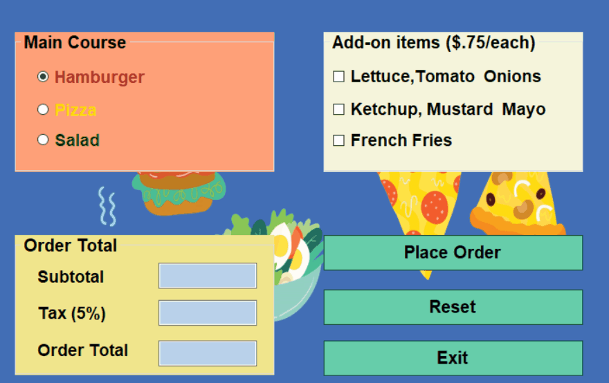

# LunchOrderApp

Create a C# application that accepts a lunch order from the user and calculates the order subtotal and
total with 5% tax added.
The application should provide for these main courses and add-ons:
Main course Price Add-on Add-on price
Hamburger 6.95 Lettuce, tomato, and onions .75
Ketchup, mustard, and mayo
French fries
Pizza 5.95 Pepperoni .50
Sausage
Olives
Salad 4.95 Croutons .25
Bacon bits
Bread sticks

Only one main course can be selected. Add-on options depend on selection of the main course. Each
add-on for a particular choice of main course has the same price, as shown in the table.
At the start, Hamburger is selected as main course, and no add-ons. User may choose no add-ons, or
multiple add-ons.
When user clicks on Place Order button, the application displays subtotal, tax amount (5% of the
subtotal), and order total (subtotal plus tax amount).

